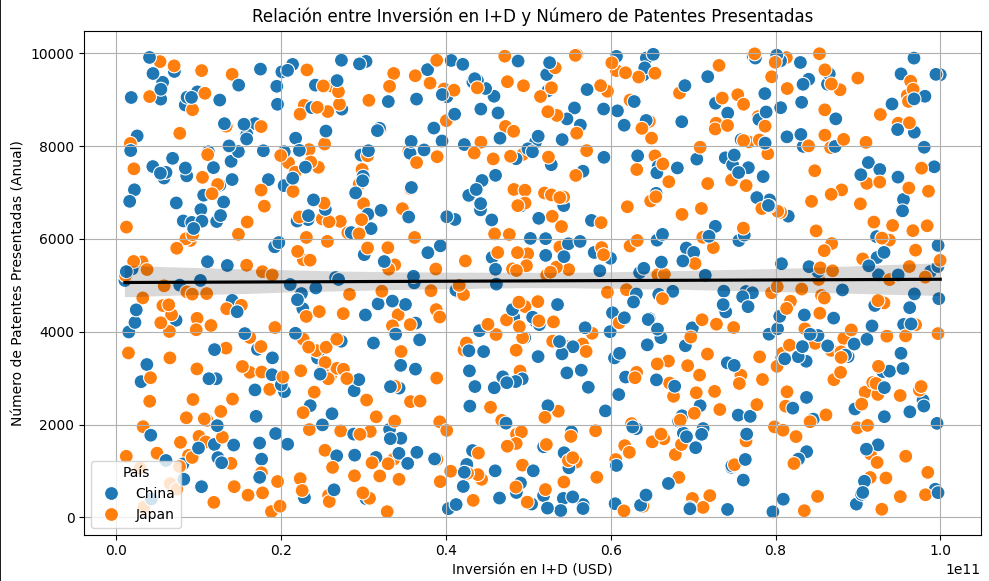

# Análisis y Resultados

## 1. Comparación del Crecimiento de Sectores Tecnológicos entre China y Japón

### Participación de Mercado
- La media de participación de mercado es de aproximadamente **27.4%** en todos los sectores tecnológicos, con un valor máximo cercano al **50%**.
- El sector de **Robótica** es el más común, seguido de sectores como **Semiconductores** y **Computación en la Nube**.

### Distribución por País
- Japón aparece ligeramente más veces que China, pero ambos países están bien representados en el dataset.
- Japón tiene una ventaja en sectores como **Software (30.94%)** y **Semiconductores (27.98%)**.
- China lidera en **Telecomunicaciones (30.29%)** y **Robótica (28.84%)**.
- En general, ambos países tienen participaciones de mercado similares en la mayoría de los sectores, con pequeñas variaciones.

### Liderazgo Tecnológico
- Japón y China compiten de manera muy pareja en términos de participación de mercado en diferentes sectores tecnológicos.

## 2. Inversión en Investigación y Desarrollo (I+D)

### Promedio
- La inversión media en I+D es de **50.34 mil millones de USD** por año, con una alta desviación estándar, lo que indica una gran variabilidad entre los sectores o los años.
- La inversión mínima registrada es de **1.05 mil millones de USD** y la máxima de **99.97 mil millones de USD**.

### Japón vs. China
- La inversión media en I+D de China es **50.23 mil millones de USD** y Japón **50.46 mil millones de USD**, lo que indica que ambos países invierten cantidades muy similares en I+D.

## 3. Relación entre la Inversión en I+D y el Número de Patentes
- Los datos muestran un promedio de **5094 patentes** presentadas al año, con una alta variabilidad.
- La correlación entre la inversión en I+D y el número de patentes es extremadamente baja (**0.007**), lo que sugiere que no existe una relación clara entre el dinero invertido en investigación y el número de patentes generadas.

## 4. Innovación Global

### Ranking Global de Innovación
- El ranking global promedio es de **13.46**, con valores que varían entre **1** (mejor) y **25**.
- Japón ocupa en promedio el puesto **9.86** y China el **10.14**, indicando que ambos están bien posicionados en la innovación mundial.

## 5. Impacto de la Cobertura de 5G y la Penetración de Internet
- La cobertura promedio de **5G** es de aproximadamente **50%**, mientras que la penetración de **internet** alcanza casi el **70%**.
- La correlación entre la cobertura de 5G y el número de startups es casi nula (**0.002**), indicando que la cobertura de 5G no parece tener un impacto directo en el crecimiento de startups.

## 6. Distribución de Startups por País y Año
- El crecimiento de startups puede variar significativamente entre China y Japón. Un análisis temporal revela patrones de crecimiento en la industria tecnológica.

## 7. Relación entre el Número de Startups y la Inversión de Capital de Riesgo
- Una correlación positiva entre el número de startups y la inversión en capital de riesgo puede indicar que a mayor inversión en startups, mayor es la cantidad de empresas emergentes.

## 8. Principales Productos Tecnológicos Exportados
- Identificar los productos tecnológicos más exportados ayuda a entender las fortalezas de cada país en el ámbito tecnológico y áreas de mayor competitividad.

## 9. Relación entre el Número de Empresas Tecnológicas y el Número de Trabajadores Tecnológicos
- Un mayor número de empresas tecnológicas suele estar relacionado con un aumento en el empleo en esos sectores.

## 10. Comparación de la Clasificación de Innovación Global con la Inversión en I+D
- Existe una fuerte relación entre la inversión en I+D y la clasificación de innovación global, subrayando la importancia de la inversión en I+D como motor de competitividad y desarrollo tecnológico.
v
