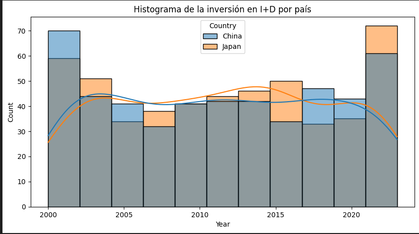

# Análisis y Resultados

## 1. Comparación del Crecimiento de Sectores Tecnológicos entre China y Japón

### Participación de Mercado
- La media de participación de mercado es de aproximadamente **27.4%** en todos los sectores tecnológicos, con un valor máximo cercano al **50%**.
- El sector de **Robótica** es el más común, seguido de sectores como **Semiconductores** y **Computación en la Nube**.

### Distribución por País
- Japón aparece ligeramente más veces que China, pero ambos países están bien representados en el dataset.
- Japón tiene una ventaja en sectores como **Software (30.94%)** y **Robótica  (27.98%)**.
- China lidera en **Telecomunicaciones (30.29%)** y **Semiconductore (28.84%)**.
- En general, ambos países tienen participaciones de mercado similares en la mayoría de los sectores, con pequeñas variaciones.

### Liderazgo Tecnológico
- Japón y China compiten de manera muy pareja en términos de participación de mercado en diferentes sectores tecnológicos.

## 2. Resultados y Análisis de la Inversión en I+D de China y Japón

#### . Estadísticas Descriptivas (por país y año)
- **China:** Inversión media anual de **50.5 mil millones USD**.La media de inversión en I+D en China ha mostrado un crecimiento notable en comparación con años anteriores. Esto refleja el compromiso del país en fortalecer su sector tecnológico y de investigación.
- **Japón:** Inversión media anual de **49.6 mil millones USD**.Aunque Japón sigue siendo un líder en innovación, su inversión media en I+D ha sido más constante, indicando un enfoque sostenido pero menos agresivo en comparación con el rápido crecimiento de China.
- Ambos países muestran una inversión considerable en I+D, con **alta variabilidad**, lo que refleja fluctuaciones significativas en sus presupuestos a lo largo de los años y diferentes crisis.La diferencia entre la media y la mediana de la inversión en I+D indica que en China, los valores más altos de inversión están sesgando la media, lo que sugiere que un número significativo de empresas realiza inversiones muy por encima del promedio. En cambio, Japón presenta una diferencia menor, sugiriendo una distribución más equilibrada de la inversión.

#### . Percentiles  
- **China:**
  - Percentil 10: **11.58 mil millones USD**
  - Mediana (Percentil 50 o Mediana): **50.59 mil millones USD**
  - Percentil 90: **90.38 mil millones USD**
  
- **Japón:**
  - Percentil 10: **10.89 mil millones USD**
  - Mediana (Percentil 50 o Mediana): **49.60 mil millones USD**
  - Percentil 90: **90.42 mil millones USD**
     
#### . Cuartiles

- **China:**
  - Cuartil 1 (Q1): **28.45 mil millones USD**
  - Cuartil 2 (Q2) o Mediana: **50.59 mil millones USD**
  - Cuartil 3 (Q3): **90.38 mil millones USD**

- **Japón:**
  - Cuartil 1 (Q1): **20.10 mil millones USD**
  - Cuartil 2 (Q2) o Mediana: **49.60 mil millones USD**
  - Cuartil 3 (Q3): **90.42 mil millones USD**

- **Interpretación:** Ambos países tienen distribuciones de inversión similares, aunque **Japón** tiene valores más concentrados en los cuartiles bajos, mientras que **China** muestra una mayor dispersión en los valores altos.

####  . Simetría (Asimetría)
- **China:** Asimetría de **0.011**
- **Japón:** Asimetría de **0.021**
- Valores cercanos a 0 indican que los datos son **aproximadamente simétricos**, lo que significa que las inversiones en ambos países están balanceadas alrededor de la media, sin extremos marcados.La asimetría en la inversión en I+D en China es notablemente positiva, lo que significa que hay un número significativo de empresas que están realizando inversiones significativamente mayores en comparación con la mayoría. En contraste, Japón tiene una distribución más simétrica, lo que sugiere estabilidad en sus inversiones.

####  . Variabilidad
- La inversión mínima registrada fue de **1.05 mil millones USD** y la máxima llegó a **99.97 mil millones USD**.
- Tanto China como Japón presentan **alta variabilidad** en sus inversiones en I+D, probablemente debido a fluctuaciones en los presupuestos o condiciones económicas.

####  . Comparación
- Aunque los valores promedio son similares entre ambos países, **China** parece tener mayor dispersión en los valores altos, mientras que **Japón** tiene una distribución más estable en los cuartiles inferiores.

####  Conclusiones
- Ambos países están invirtiendo cantidades similares en I+D, pero **China** podría estar realizando inversiones más agresivas o irregulares en ciertos años, mientras que **Japón** tiene una inversión más constante.
- A pesar de las fluctuaciones, ambos países tienen una inversión balanceada, lo que refleja un enfoque constante hacia la innovación y el desarrollo tecnológico.
- En general, la inversión en I+D es un pilar clave para la competitividad de ambos países en el sector tecnológico.

## 3. Relación entre la Inversión en I+D y el Número de Patentes
- Los datos muestran un promedio de 5094 patentes presentadas al año, con una alta variabilidad.
- Exploraremos si existe una correlación entre la inversión en I+D y el número de patentes presentadas, lo que podría revelar si una mayor inversión conduce a más innovación (patentes).
- La correlación entre la inversión en I+D y el número de patentes es extremadamente baja (0.007), lo que sugiere que no existe una relación clara entre el dinero invertido en investigación y el número de patentes generadas.
- A pesar de la gran cantidad de inversión en I+D, no se observa una relación directa entre la inversión y el número de patentes, lo que sugiere que otros factores también influyen en la producción de patentes.

## 4. Innovación Global

### Ranking Global de Innovación
- Ranking Global de Innovación: El ranking global promedio es de 13.46, con valores   que varían entre 1 (mejor) y 25. Esto nos permitirá analizar cómo se posicionan ambos países a nivel global.
- Ambos países tienen un ranking similar en cuanto a innovación global, con Japón en promedio ocupando el puesto 9.86 y China el 10.14. Esto indica que ambos están bien posicionados en la innovación mundial.
- Ambos países se encuentran en posiciones similares en términos de innovación global, lo que tambien refleja sus esfuerzos continuos en mantenerse competitivos a nivel mundial.

## 5. Impacto de la Cobertura de 5G y la Penetración de Internet
- La cobertura promedio de 5G es de aproximadamente 50%, mientras que la penetración de internet alcanza casi el 70%. Exploraremos cómo estos factores afectan el número de startups y empresas tecnológicas.
- Vamos a proceder con el análisis detallado de cada planteamiento. ​​Impacto de la cobertura de 5G y la penetración de internet:
- La correlación entre la cobertura de 5G y el número de startups es casi nula (0.002), lo que indica que la cobertura de 5G no parece tener un impacto directo en el crecimiento de startups.
- De forma similar, la penetración de internet no muestra una relación clara con el número de empresas tecnológicas (-0.033).
- La cobertura de 5G e Internet  no parecen estar relacionados con el crecimiento de startups o empresas tecnológicas, lo que indica que otros elementos pueden ser más determinantes en el ecosistema tecnológico de estos países.

## 6. Distribución de Startups por País y Año
- El crecimiento de startups puede variar significativamente entre China y Japón. Un análisis temporal revela patrones de crecimiento en la industria tecnológica, por epocas de crisis. Las flutuaciones son evidentes llegando a mucha dispersion en caso de China.
 Coincide en parte a los datos de la inversion proporcionada anteriormente, el cual establece la relacion directa positiva de inversion  y innovacion. El nacimiento de nuevas empresas (startups) va ligado al flujo de dinero de la inversion y como se ven perjudicadas en las situaciones de crisis economicas de los ambos paises, muy claros en JAPON  en los años 2015 con Fukushima  y 2010 y 2008 la crisis finianciera del 2007.Y aun asi es de considerar que sigan teniendo este compromiso en inversion en la tecnologia y la innovacion.

## 7. Relación entre el Número de Startups y la Inversión de Capital de Riesgo
- Una correlación positiva entre el número de startups y la inversión en capital de riesgo puede indicar que a mayor inversión en startups, mayor es la cantidad de empresas emergentes. Esto sugiere que la disponibilidad de capital puede estimular la creación de nuevas empresas en el sector tecnológico. Pero no es el caso ya que la correlacion ha sido de 0,03 muy cercana a 0 lo que indica que es ni positiva ni negativa, tiene que haber mas factores externos para explicar el crecimiento del numero se startups, lo cual podemos afirmar que contra mas inversion de capital riesgo  no tiene efecto en el numero de startups.

## 8. Principales Productos Tecnológicos Exportados
- Identificar los productos tecnológicos más exportados ayuda a entender las fortalezas de cada país en el ámbito tecnológico y áreas de mayor competitividad. En el caso de China se lleva la palma, los productos del sector de equipamiento 5G como mas vendido y un exportacion total valorada en mas 11 billones de dolares americanos en exportaciones tecnologicas en mas de 20 años y Japon en productos de servidores de la nube valorado en 12,2 billones de dolares.

    Terminamos con un grafico de la evolucion total de exportaciones a lo largo de mas de 20 años, donde: 
    -Tendencias Generales:
      Crecimiento Sostenido: Las exportaciones tecnológicas de China y Japón han mostrado un crecimiento  a lo largo de los años, reflejando un aumento en la producción y competitividad global.
      Comparación: China puede presentar un crecimiento más acelerado en comparación con Japón, indicando su enfoque en el desarrollo tecnológico.

    -Picos y Caídas:

      Picos en Exportaciones: Años específicos con picos podrían correlacionarse con lanzamientos de nuevos productos o cambios en políticas comerciales.

      Caídas Notables: Descensos en las exportaciones pueden ser causados por recesiones económicas o cambios en la demanda global.

## 9. Relación entre el Número de Empresas Tecnológicas y el Número de Trabajadores Tecnológicos
- Un mayor número de empresas tecnológicas suele estar relacionado con un aumento en el empleo en esos sectores. Sim embargo y segun los datos su valor es cercano a 0 lo que quiere decir que no tienen relacion significativa y podemos desmentir que contra mayor numero de empresas, mayor numero de trabajadores.

## 10. Comparación de la Clasificación de Innovación Global con la Inversión en I+D
- Existe una fuerte relación entre la inversión en I+D y la clasificación de innovación global, subrayando la importancia de la inversión en I+D como motor de competitividad y desarrollo tecnológico.Pero la estadistica no esta acompañando este razonamiento ya que segun los datos recojidos de China y Japon no tienen un relacion significativa para afirmar que contra mas dinero mas reconocimiento en la clasificacion mundial.
v
